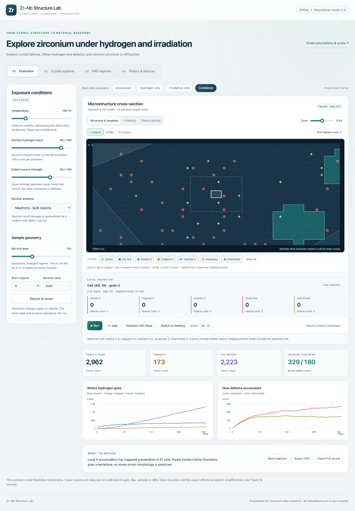
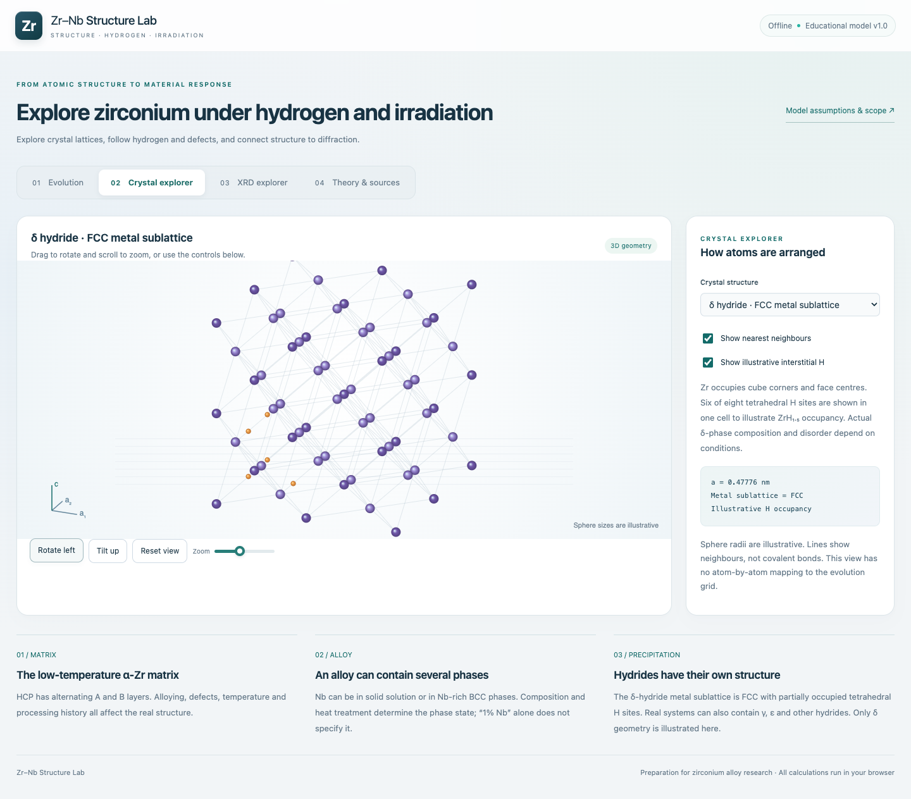
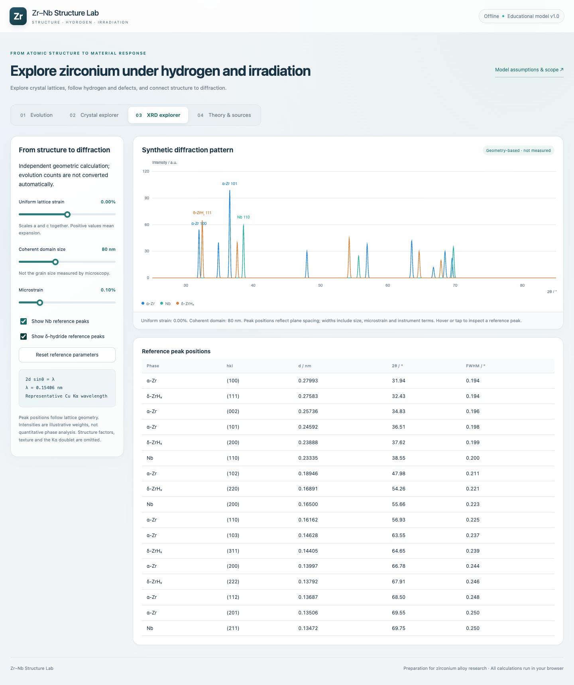

# Zr–Nb Structure Lab 🔬

**[Try the live lab →](https://jekyll-chan.github.io/zrnb-structure-lab/)** · [GitHub repository](https://github.com/Jekyll-Chan/zrnb-structure-lab)

**What happens when hydrogen meets a zirconium alloy? Let's poke around and find out.**

A little browser lab for a surprisingly busy material: hydrogen moves, defects appear, traps fill up, and hydride markers start showing up. Turn a few knobs, zoom into a grain, then hop over to the crystal and XRD explorers to connect the dots.

Built for learning about zirconium–niobium alloys, hydrogen and irradiation. The interface is in English, and the whole thing runs locally in your browser. No account, no backend, no build step.

> **A quick reality check:** this is an uncalibrated educational model. It helps you explore mechanisms and ask better research questions. Its counts, steps and synthetic patterns are **not experimental data or validated predictions**.


*Actual app screenshot: zoomed into a combined-exposure run, with exact counts for the selected cell.*

## Open it and start exploring

**[Open Zr–Nb Structure Lab in your browser](https://jekyll-chan.github.io/zrnb-structure-lab/)** — no installation needed.

Want to use it offline? Download the files from the [GitHub repository](https://github.com/Jekyll-Chan/zrnb-structure-lab) using **Code → Download ZIP**, unzip them, and open **`index.html`**. Keep the accompanying files together. Node.js is only needed for development tests, not to use the app.

## Your first five minutes

### 1. Give hydrogen somewhere to go

Choose **Hydrogen only**, then hit **Advance 100 steps** five times. Watch the left-hand side: that's where H enters. Try **Find highest count** to jump straight into the busiest cell.

Blue dots are mobile H, gold squares are trapped H, and purple diamonds mark the hydride reservoir. Curious about what overlaps? Hide a layer or click a cell. The inspector gives you the actual counts — each symbol is a presence marker, not a single atom.

### 2. Turn up the heat

Save a snapshot, then choose **Switch to heating**. This keeps the existing structure, sets the temperature to 600 °C and switches off both external sources.

Advance another 500 steps. H can move between reservoirs, and defects can recover. Total H stays constant because this model has no surface-release mechanism. That's a useful place to start asking what a more realistic model would need.

### 3. Change one thing at a time

Repeat a run with the same seed, geometry and step count, but change one exposure condition. Compare snapshots. Change everything at once and it's much harder to tell what caused what!

### 4. Take a look inside the crystal

Open **Crystal explorer** and rotate HCP α-Zr, BCC Nb or the FCC metal sublattice of δ hydride. Switch the H markers and neighbour lines on and off. The orange spheres illustrate selected interstitial sites; their number is not a measured H concentration.


*Rotate, tilt and zoom. The geometry and reference lattice parameters are explained alongside the model.*

### 5. Make a diffraction peak move

In **XRD explorer**, increase uniform lattice strain from 0 to +0.5%. The reference peaks shift to lower angles. Reset, then reduce coherent domain size: now the peaks broaden.

Two different structural changes, two different clues. The explorer keeps them separate so you can see each effect.


*These are calculated reference patterns with illustrative intensities, not measured diffractograms.*

## What's in the toolbox?

| Tool | What you can do |
|---|---|
| **Interactive 2D map** | Follow H reservoirs and vacancy–interstitial populations across grain and Nb-rich regions. |
| **Layer controls** | Toggle grains, Nb-rich regions and each H/defect species independently. Colour and shape both carry meaning. |
| **Density views** | Inspect total H or total defects per cell. The displayed logarithmic colour scale auto-ranges, so check its range before comparing runs. |
| **Local inspector** | Click a cell for exact counts and totals in its surrounding 5 × 5 neighbourhood, clipped at sample edges. |
| **Zoom and pan** | Explore at 1–5×, drag with **Pan**, or use Ctrl/⌘ + scroll. **Fit sample** brings you home. |
| **Step controls** | Run, pause, advance one step or advance 100 steps. Each run is capped at 2,000 model steps. |
| **Exposure scenarios** | Try hydrogen, neutron, proton, heavy-ion or electron teaching scenarios. |
| **Snapshots and exports** | Keep up to six comparison snapshots; export CSV histories or a fuller JSON record. |
| **Crystal and XRD explorers** | Connect lattice geometry to atom arrangements, plane spacings and synthetic diffraction. |
| **Theory & sources** | Read the assumptions, equations, parameter provenance and linked papers. |

**Keyboard tip:** focus the 2D map and use the arrow keys to move the selection, `+`/`−` to zoom, or `Escape` to clear it. The interface also respects your system's reduced-motion preference.

## A few things worth knowing before interpreting a run

The three modules are independent teaching models. The 2D grid does not automatically determine the crystal structure or the XRD pattern.

- Model steps are **not seconds**, H tracer counts are **not ppm**, and defect counts are **not dpa**.
- The grid has no calibrated physical length. The Nb-rich area slider is **not Nb wt.%** or a measured phase fraction.
- The evolution engine uses simplified stochastic rules. It is not molecular dynamics, phase-field modelling or finite-element analysis.
- Neutrons and electrons currently share the same uniform defect-source rule. That simplification does not mean their real interactions are equivalent.
- Proton mode adds H as well as defects, using an illustrative ratio and profile. Heavy-ion mode uses clustered sources, not a resolved collision cascade.
- No strength, toughness, cracking, service-life or real irradiation-dose predictions are made.
- XRD peak positions follow the reference geometry. Intensities are teaching weights; broadening is an isotropic approximation.

The complete rules live in **[MODEL.md](MODEL.md)**. For actual alloy research, the next step is to choose a specific material and experiment, obtain defensible parameters, then validate against measurements.

## Keep a record before you refresh

Everything runs in your browser. There is no cloud storage or telemetry in the app. External literature links open only when you follow them.

- **CSV:** count histories, model version, seed, initial/current settings and parameter changes.
- **JSON:** those records plus the final grid and saved snapshots.
- Refreshing the page clears the current session. Export anything you want to keep.
- There is no import/resume interface yet. A protocol can be replayed in code from its seed, initial parameters and staged changes; the exported grid is not an RNG checkpoint.

## Want to tinker with it?

Plain HTML, CSS, JavaScript and Canvas. No runtime dependencies.

```text
index.html          Interface, learning notes and sources
styles.css          Layout, controls and motion
engine.js           Stochastic rules and diffraction calculations
micro-view.js       2D rendering, layers, zoom, pan and inspection
app.js              Controls, charts, crystal view and exports
MODEL.md            Equations, assumptions and parameter provenance
docs/images/        Screenshots used in this README
tests/              Model and browser checks
qa/                 Local validation notes and generated test screenshots
```

Run the dependency-free model checks with Node.js:

```sh
node tests/engine.test.js
```

For browser checks:

```sh
npm install
npx playwright install chromium
npm run test:browser
```

To use an existing Chrome installation instead, set `BROWSER_EXECUTABLE` to its executable path. Browser tests generate screenshots in `qa/`.

Checks cover count conservation, deterministic replay, XRD relationships, controls, exports, responsive layout, hotspot selection and view-only state invariance. Passing these checks establishes software behaviour — it does not validate the model against real materials.

## Reading that inspired the questions

The app links to six sources and identifies which lattice values come from which paper. A few starting points:

- [Hydrogen Sorption Kinetics of SiC-Coated Zr-1Nb Alloy](https://doi.org/10.3390/coatings9010031) — representative α-Zr lattice values and hydrogen uptake.
- [Hydride Rim Formation in E110 Zirconium Alloy during Gas-Phase Hydrogenation](https://doi.org/10.3390/met10020247) — hydride formation and a specimen-specific δ lattice parameter.
- [Effect of Hydrogen on the Deformation Behavior and Localization of Plastic Deformation of the Ultrafine-Grained Zr–1Nb Alloy](https://doi.org/10.3390/met10050592) — hydrogen, starting microstructure and deformation.
- [Distribution of Hydrogen and Defects in the Zr/Nb Nanoscale Multilayer Coatings after Proton Irradiation](https://doi.org/10.3390/ma15093332) — proton irradiation in multilayers, a different material geometry from bulk alloys.

These papers motivate the questions. They do **not** calibrate the teaching probabilities in this code.

---

Found a confusing control, a broken interaction or a scientific explanation that needs work? Open an issue with what you tried, what happened, and — for a model run — the seed and settings. A reproducible example goes a long way. 🔎
